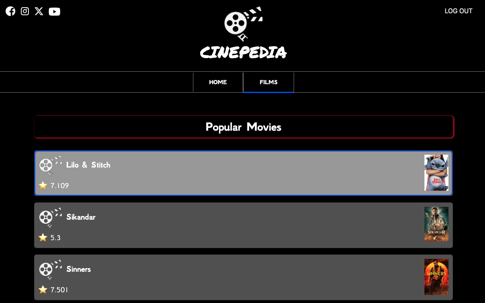

# Cinepedia



## Project Description

**Cinepedia** is a responsive and interactive single-page application built with Angular 17+ using **Standalone Components** and **Bootstrap**. The app allows users to explore detailed movie information and view credits using The Movie Database (TMDb) API.

The architecture is modular and scalable, and the UI is powered by **Angular Signals** for a fully reactive experience. The project is also covered by **unit tests** using **Karma** and **Jasmine**, ensuring reliability and maintainability.

## Technologies and Tools Used

- **Angular 17+ with Standalone Components**
- **TypeScript**
- **CSS and Bootstrap** (custom styles and responsive design)
- **Angular Signals & Computed**
- **Unit Testing** with **Karma + Jasmine**
- **VS Code** as the main development environment

## Requirements

- **Modern browser**: Chrome, Firefox, Safari, Edge
- **Node.js**: version 18.x or higher recommended
- **Angular CLI**: globally installed (`npm install -g @angular/cli`)

## Developer Prerequisites

To contribute or run this project, you should have:

- Solid understanding of Angular concepts: components, routing, services, signals
- Experience with TypeScript and modular CSS
- Familiarity with the Angular CLI and Git

## ⚙️ Environment Configuration

This project uses multiple environment files to separate development, production, and private local configurations.

### Environment Files

| File                                     | Committed to repo? | Purpose                               |
|------------------------------------------|---------------------|----------------------------------------|
| `src/environments/environment.ts`        | ✅ Yes              | Default development (`ng serve`)       |
| `src/environments/environment.prod.ts`   | ❌ No               | Automatically generated on Vercel      |
| `src/environments/environment.local.ts`  | ❌ No               | Used only locally with real credentials |

### 🧩 Setup after cloning

After cloning the repository, create a file named `src/environments/environment.ts` with the following structure:

```ts
export const environment = {
  production: false,
  TMDB_API_KEY: '',
  firebaseConfig: {
    apiKey: '',
    authDomain: '',
    projectId: '',
    storageBucket: '',
    messagingSenderId: '',
    appId: ''
  }
};
```

## Getting Started

### 1. Clone the repository

```bash
git clone https://github.com/VictorGonPe/cinepedia.git
cd cinepedia
```

### 2. Install Angular CLI

```bash
npm install -g @angular/cli
```

### 3. Install Project dependencies

```bash
npm install
```

### 4. Start the development server

```bash
ng serve -o
```


## Running unit tests

To execute unit tests with the [Karma](https://karma-runner.github.io) test runner, use the following command:

```bash
ng test
```


